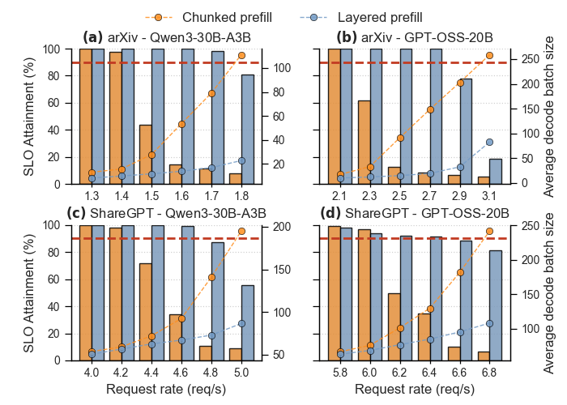

# Layered Prefill

Layered Prefill changes the scheduling axis from tokens to layers and removes redundant MoE weight reloads while keeping decode stall free. The result is lower TTFT, lower end-to-end latency, and lower energy per token without hurting TBT stability.

## How to install

```bash
conda create -n layered-prefill python=3.10 -y
conda install -n layered-prefill cuda-toolkit cuda-version=12.8 cmake ninja ccache c-compiler cxx-compiler -c nvidia
conda activate layered-prefill
pip install torch==2.8.0 uv httpie psutil amd-quark
git clone https://github.com/vllm-project/flash-attention.git flash-attention
cd flash-attention; git checkout d9e577e; patch -p0 < ../flash-attention.patch; cd ..
TORCH_CUDA_ARCH_LIST="8.0;9.0" CCACHE_NOHASHDIR="true" uv pip install -e flash-attention --verbose --refresh --no-build-isolation

CCACHE_NOHASHDIR="true" uv pip install -e . --no-build-isolation --verbose --refresh
```

## How to run

```bash
# chunked prefill
CUDA_VISIBLE_DEVICES=0 python nanovllm/entrypoints/api_server.py --model /data/cache/huggingface/hub/models--Qwen--Qwen3-8B/snapshots/9c925d64d72725edaf899c6cb9c377fd0709d9c5/ --max-num-batched-tokens 512 --max-num-seqs 256 --max-model-len 32768 --gpu-memory-utilization 0.9 --tensor-parallel-size 2 --schedule-mode chunked-prefill --num-stages 1

# layered prefill
CUDA_VISIBLE_DEVICES=0 python nanovllm/entrypoints/api_server.py --model /data/cache/huggingface/hub/models--Qwen--Qwen3-8B/snapshots/9c925d64d72725edaf899c6cb9c377fd0709d9c5/ --max-num-batched-tokens 8192 --max-num-seqs 256 --max-model-len 32768 --gpu-memory-utilization 0.9 --tensor-parallel-size 2 --schedule-mode layered-prefill --num-stages 12
```

## Algorithm


The model is partitioned into contiguous layer groups and prefill advances one group per iteration while every group continues to run decode. At each iteration exactly one designated group performs decode with prefill for newly admitted requests. All other groups execute decode only. Prefill then moves to the next group in the following iteration and completes after the number of groups many iterations. Decode never pauses and stall free behavior holds throughout.

The key effect is that a prompt traverses each layer once during prefill. Chunk based methods repeat the full stack for every chunk and reload MoE experts over and over. Layered Prefill eliminates this chunk amplified reload. Off chip bandwidth drops and energy follows. Because decode work exists in every iteration, TBT remains within the SLO envelope.

The method is orthogonal to chunking. When very long inputs must be pipelined, you can still chunk while using Layered Prefill to raise the chunk size safely. Fewer chunks mean fewer expert reloads and less bandwidth. With sufficiently large effective chunks MoE shifts from memory bound toward compute bound which further moderates latency growth.

We made the following key observations. First, Layered Prefill expands the TTFT and TBT Pareto frontier and sustains higher SLO attainment at higher request rates than chunked prefill. Queueing and prefill time drop while TBT quality stays strong.



Second, throughput under SLO improves on both arXiv and ShareGPT style traces. On arXiv the system holds near perfect SLO to higher request rates where chunked prefill already collapses. On ShareGPT the advantage persists at higher load as well.


Third, latency quality improves. At the same request rate on arXiv with a representative MoE model the mean TTFT falls by about half and the tail TTFT drops markedly. The token generation trajectory shows an earlier first token and a steeper slope over wall clock time which shortens end-to-end latency for a single request.

Fourth, energy per token goes down. We define energy per token as total GPU energy divided by the sum of prompt and generated tokens. Layered Prefill reduces this metric on both models and datasets. The reduction aligns with the measured cut in redundant expert weight traffic.

Fifth, MoE traffic decreases. Expert weight load bytes shrink on both traces with larger gains for long prompts where chunking would otherwise trigger repeated reloads. The traffic reduction is consistent with the SLO gains at high request rates.

Finally, raising chunk size alone cannot recover the same benefits under chunked prefill. Larger chunks reduce runtime and energy but inflate tail TBT and violate SLO at scale. Layered Prefill preserves the efficiency of large effective chunks without the TBT regressions because decode continues every iteration.

## Citation

If you use layered prefill for your research, please cite our [paper](https://arxiv.org/abs/2510.08055):
```bibtex
@misc{lee2025tokenslayersredefiningstallfree,
      title={From Tokens to Layers: Redefining Stall-Free Scheduling for LLM Serving with Layered Prefill},
      author={Gunjun Lee and Jiwon Kim and Jaiyoung Park and Younjoo Lee and Jung Ho Ahn},
      year={2025},
      eprint={2510.08055},
      archivePrefix={arXiv},
      primaryClass={cs.LG},
      url={https://arxiv.org/abs/2510.08055},
}
```
